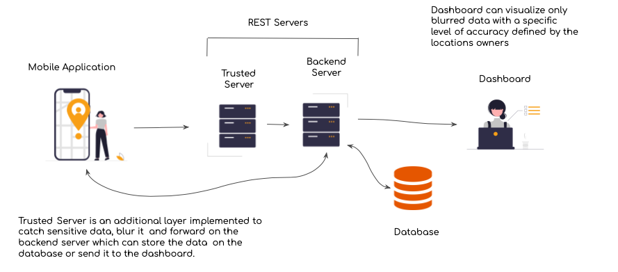

# Privacy-aware Crowdsensing

        
	
	
  
  

Piattaforma di mobile crowdsensing (piattaforma raccolta dati attraverso la collaborazione da parte degli utenti), per il monitoraggio dell’inquinamento acustico in uno scenario urbano.

## Funzionalità

La piattaforma è in grado di poter inviare un rumore rilevato in maniera periodica e semi-automatica o manuale andando a definire dei criteri di privacy personalizzati dall'utente front-end. La manipolazione dei dati sensibili viene effettuata all'interno di un server trusted capace di poter stabilire un meccanismo di offuscamento basato sull'algoritmo di spatial cloaking. Ogni rilevamento ha un tempo di vita limitato, scelto dall'utente e rispettato nel trusted server all'interno di una lista logica che ha la funzionalità di buffer di sistema, in modo da aggregare e raccogliere dati provenienti da differenti utenti e utilizzarli per lo spatial cloaking (andando a considerare i principi di privacy definiti dai parametri k e range di ogni rilevazione. Infine, dopo il camuffamento dei dati, si avrà come output un rilevamento offuscato inoltrato al back-end server, visualizzato in una dashboard e salvato in maniera persistente in un database insieme alle informazioni di servizio legate ai criteri di valutazione di Quality of Service e privacy, nonchè del valore di trade-off tra i due. 

## Tecnologie utilizzate

1. PostGIS per la gestione del back-end sui dati spaziali
2. OpenLayers per la gestione dei dati spaziali nella dashboard del front-end
3. Node.js per la gestione del server trusted utilizzato per il meccanismo di cloaking spaziale
4. PostgreSQL come DBMS di gestione delle informazioni spaziali
5. App Android basata su Java (SDK 17 -  Oreo 8.1)

## Utilizzo del progetto

Il progetto è stato deployato localmente su delle macchine dedicate per il testing e utilizzato esclusivamente per fornire un sistema funzionante in grado di poter far testare per scopi accademici alcuni meccanismi di privacy spaziale tipici dell'ambito context-aware. 

## Contributors
- Andrea Gurioli (@andreagurioli1995)
- Giovanni Pietrucci (@giovanniPi997)
- Mario Sessa (@kode-git)

